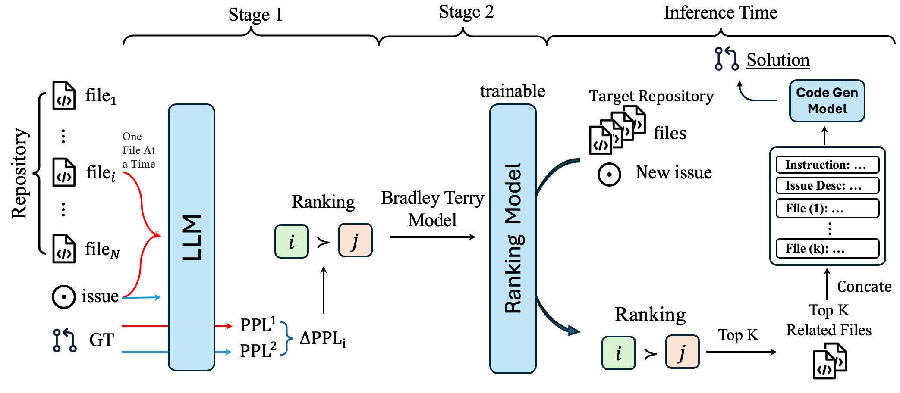

# CS 291 Final Project

Title: Code Retrieval Through Unsupervised Contextual Relevance Trimming

Group members: Weixiang Yan, Zhen Zhang, Wanjing Huang

## Abstract

Retrieval-Augmented Generation (RAG) has recently emerged as a promising approach for repository-level code generation, integrating cross-file knowledge with preceding in-file code to provide comprehensive context for generation. To better understand the contribution of retrieved cross-file contexts, we introduce a perplexity-based unsupervised method to evaluate the impact of each retrieved code block on code generation. Our analysis reveals that despite retrieving numerous blocks, only a small fraction contributes positively to the target completion, while certain blocks even degrade performance. To address this issue, we propose a two-stage unsupervised learning approach to tackle the input length limitation problem in code generation tasks: first obtaining preliminary file relevance rankings by calculating the impact of file contexts on language model perplexity, then training a relevance prediction model using the Bradley-Terry model, ultimately selecting only the most relevant files as input context during inference. We conduct training on the SWE-Bench training dataset to mitigate the harmful effects of negative retrieval contexts in RAG-based code completion. Extensive evaluation on the SWE-Bench Verified benchmark demonstrates that our approach not only improves retrieval recall but also consistently enhances completion accuracy.

## Workflow



## Environment Setup

```bash
conda create -n project python==3.9
conda activate project
pip install -r requirements.txt
git clone https://github.com/hiyouga/LLaMA-Factory.git
cd LLaMA-Factory
pip install -e ".[torch,metrics]"
cd ..
cd SWE-bench
pip install -e .
cd ..
```

## Generate Preference Data

```python
python generate_preference_data.py
```

The data will appear in `./data`.

We just upload a sample version cause the full file is too large.

Data info:

```json
{
    "preference_data": {
        "file_name": "preference_data.json",
        "ranking": true,
        "formatting": "sharegpt",
        "columns": {
          "messages": "conversations",
          "chosen": "chosen",
          "rejected": "rejected"
        }
      }
}
```

## Ranking LLM Training

```
llamafactory-cli train llama3_lora_reward.yaml
```

You will get ranking model in `./saves`.

If you want better performance, try full model finetuning instead of LoRA.

## Evaluation

Install docker desktop on your laptop first.

Merge LoRA model:

```
llamafactory-cli export /home/zhenzhang/dir1/swe/llama3_lora_sft_merge.yaml
```

Deploy ranking model api:

```
llamafactory-cli api --template llama3 --stage rm --model_name_or_path models/llama3_lora_reward
```

Pre-process the relevance score:

```
python -m swebench.inference.make_datasets.ranking_model_retrieval --dataset_name_or_path princeton-nlp/SWE-bench --output dir ./retrieval_results --splits test
```

Run evaluation:

```
python -m swebench.harness.run_evaluation  --predictions_path gold  --max_workers 1  --instance_ids sympy__sympy-20590  --run_id validate-gold
```

You may adjust the `--instance_ids` to run on different instances.
